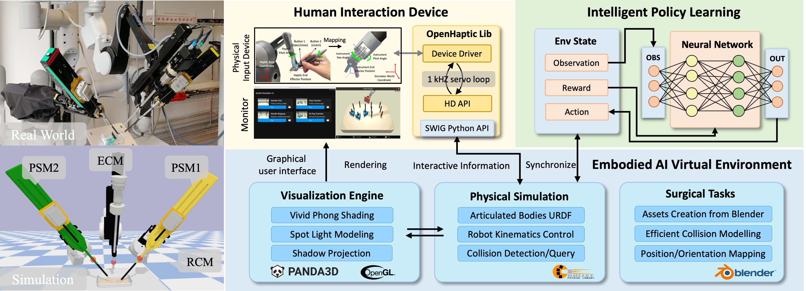
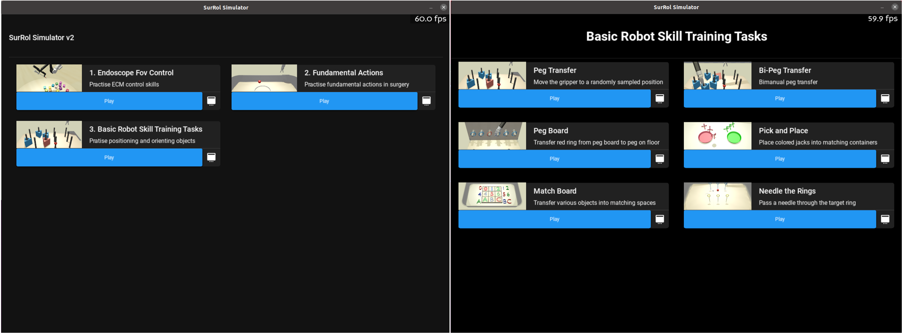
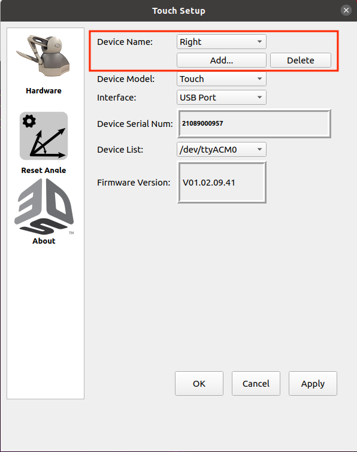

# [SurRoL-v2](https://med-air.github.io/SurRoL/)

Under development...

<p align="center">
   
</p>

- [Human-in-the-loop Embodied Intelligence with Interactive Simulation Environment for Surgical Robot Learning](https://arxiv.org/abs/2301.00452)

## Features

- [dVRK](https://github.com/jhu-dvrk/sawIntuitiveResearchKit/wiki) compatible [robots](./surrol/robots).
- [Gym](https://github.com/openai/gym) style [API](./surrol/gym) for reinforcement learning.
- 14 surgical-related [tasks](./surrol/tasks).
- Various object [assets](./surrol/assets).
- Based on [PyBullet](https://github.com/bulletphysics/bullet3) for physics simulation.
- Based on [Panda3D](https://www.panda3d.org/) for GUI and scene rendering.
- Allow human interaction with [Touch Haptic Device](https://www.3dsystems.com/haptics-devices/touch).
- Extenable designs which allows customization as needed.

## Installation

The project is built on Ubuntu with Python 3.7.

### 1. Install prerequisites

Run following commands in the terminal to install build-essential and cmake:

 ```shell
sudo apt-get install build-essential
sudo apt-get install cmake
 ```

Install Anaconda following the [Official Guideline](https://www.anaconda.com/).


### 2. Prepare environment

Create a conda virtual environment and activate it:

 ```shell
 conda create -n surrol python=3.7 -y
 conda activate surrol
 ```

### 3. Install SurRoL

Install SurRoL in the created conda environment:

   ```shell
   git clone --recursive -b SurRoL-v2 https://github.com/med-air/SurRoL.git
   cd SurRoL
   pip install -e .
   ```

### 4. Install PyTorch Following the [Official Guideline](https://pytorch.org/get-started/locally/) using Conda.


## Get started

The robot control API follows [dVRK](https://github.com/jhu-dvrk/dvrk-ros/tree/master/dvrk_python/src/dvrk)
(before "crtk"), which is compatible with the real-world dVRK robots.

You may have a look at the jupyter notebooks in [tests](./tests).
There are some test files for [PSM](./tests/test_psm.ipynb) and [ECM](./tests/test_ecm.ipynb),
that contains the basic procedures to start the environment, load the robot, and test the kinematics.

To start the SurRoL-v2 GUI with keyboard input, you can run the following command to preview:
```shell
cd ./tests/
python test_multiple_scenes_keyboard.py
```
Then you will see the following windows:
<p align="center">
   
</p>

## Control with Touch Haptic Device

### 1. Install Driver and Dependencies for Touch Haptic Device

1. Install [OpenHaptic Device Driver](https://support.3dsystems.com/s/article/OpenHaptics-for-Linux-Developer-Edition-v34?language=en_US)    

2. Setup Device Name for Identification.

     Run the "Touch_Setup" software provided by the OpenHaptic Device Driver. 
     <p align="left">
      
      </p>
     Set the right device name as "right" and set the left device name as "left".

3. Install SWIG (>=4.0.2) -- https://www.swig.org/

4. Compile the Python API of Touch Haptic Device for SurRoL-v2
    ```shell
    bash setup_haptic.sh
    ```

### 2. Start the SurRoL-v2 GUI with Touch

To start the SurRoL-v2 GUI with Touch (haptic device) support, run the following command:
```shell
cd ./tests/
python test_multiple_scenes_touch.py
```

## Training RL Policy with Demonstrations

Codes for RL policy learning are implemented in [rl](./rl), which are on top of [DEX](https://github.com/med-air/DEX/tree/main) (based on OpenAI baselines).

- Train **DDPGBC** with demonstrations with following command:
```bash
python3 rl/train.py task=NeedlePick-v0 agent=ddpgbc use_wb=True demo_path=your_demo_path
```
Note that you should specify the path of demonstration data you would like to provide to the RL agent, which could be collected by both human demonstrators or scripted controllers. For the latter, please refer to [here](../surrol/data/) for more details.

# Code Navigation

```
SurRoL
   |- surrol                     # simulator enviroment
   |	|- assets                  # assets (meshes and urdf files)
   |	|- data                    # implementation of script demonstration
   |	|- gui                     # implementation of graphical user interface (GUI)
   |	|- gym                     # implementation of basic surrol environment
   |	|- robots                  # implementation of dVRK robots (PSM & RCM) with PyBullet
   |	|- tasks                   # implementation of multiple surgical tasks
   |	|- utils                   # implementation of surrol utilities
   |- haptic_src                 # source codes to enable human input with Touch haptic device
   |- rl	                        # implementation of RL policy learning
   |	|- agents                  # implements core algorithms in agent classes
   |	|- components              # reusable infrastructure for model training
   |	|- configs                 # experiment configs 
   |	|- modules                 # reusable architecture components
   |	|- trainers                # main model training script
   |	|- utils                   # rl utilities, pytorch/visualization utilities etc.
   |	|- train.py                # experiment launcher
   |- ext                        # 3rd party extentions and plug-ins
   |- tests                      # SurRoL-v2 launcher and test codes
        |- images                # fodler to store gui images
        |- needle_pick_model     # fodler to store trained needle pick demo policy
        |- peg_transfer_model    # fodler to store trained peg transfer demo policy
        |- recorded_human_demo   # recorded human demonstrations and post-processing code
            |- convert.py        # pack multiple demonstrations into one file (.npz) for RL learning
        |- test_ecm.ipynb        # test ECM kinematics in surrol
        |- test_psm.ipynb        # test PSMs kinematics in surrol
        |- test_multiple_scenes_keyboard.py     # start SurRoL-v2 GUI with keyboard input to preview
        |- test_multiple_scenes_touch.py        # start SurRoL-v2 GUI with Touch device input
        |- test_multiple_scenes_record_demo.py  # record demos with SurRoL-v2 GUI and Touch
    |- setup.py                  # setup required python package (for installation only)
    |- setup_haptic.sh           # setup Touch Haptic Device
```

## Citation

If you find the paper or the code helpful to your research, please cite the project.

```
@inproceedings{xu2021surrol,
  title={SurRoL: An Open-source Reinforcement Learning Centered and dVRK Compatible Platform for Surgical Robot Learning},
  author={Xu, Jiaqi and Li, Bin and Lu, Bo and Liu, Yun-Hui and Dou, Qi and Heng, Pheng-Ann},
  booktitle={2021 IEEE/RSJ International Conference on Intelligent Robots and Systems (IROS)},
  year={2021},
  organization={IEEE}
}

@article{long2023human,
  title={Human-in-the-loop Embodied Intelligence with Interactive Simulation Environment for Surgical Robot Learning},
  author={Long, Yonghao and Wei, Wang and Huang, Tao and Wang, Yuehao and Dou, Qi},
  journal={IEEE Robotics and Automation Letters (RAL)},
  year={2023}
}
```
## License

SurRoL is released under the [MIT license](LICENSE).


## Acknowledgement

The code is built with the reference of [dVRK](https://github.com/jhu-dvrk/sawIntuitiveResearchKit/wiki),
[AMBF](https://github.com/WPI-AIM/ambf),
[dVRL](https://github.com/ucsdarclab/dVRL),
[RLBench](https://github.com/stepjam/RLBench),
[Decentralized-MultiArm](https://github.com/columbia-ai-robotics/decentralized-multiarm),
[Ravens](https://github.com/google-research/ravens), etc.
