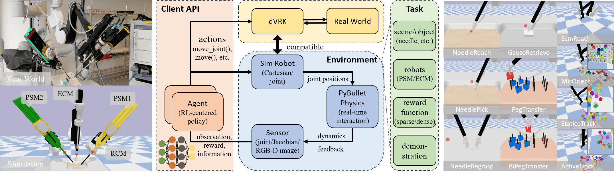

# SurRoL

<p align="center">
   
</p>

## License

SurRoL is released under the [MIT license](LICENSE).

## Citation

If you find the paper or the code helpful to your research,
please cite the project.

```
@inproceedings{xu2021surrol,
  title={SurRoL: An Open-source Reinforcement Learning Centered and dVRK Compatible Platform for Surgical Robot Learning},
  author={Xu, Jiaqi and Li, Bin and Lu, Bo and Liu, Yun-Hui and Dou, Qi and Heng, Pheng-Ann},
  booktitle={2021 IEEE/RSJ International Conference on Intelligent Robots and Systems (IROS)},
  year={2021},
  organization={IEEE}
}
```
