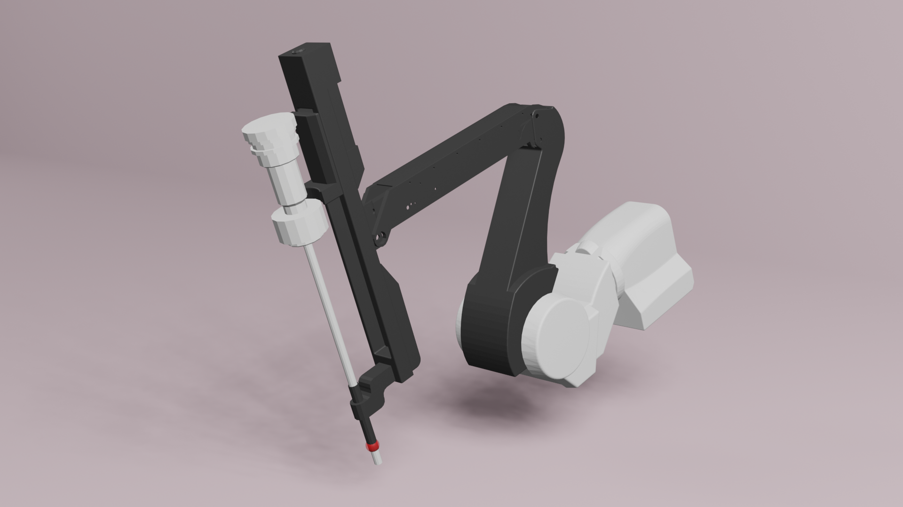

### dVRK ECM

<p align="center">
   
</p>

The ecm_ori.urdf is generated from [WPI-AIM ECM](https://github.com/WPI-AIM/dvrk_env/tree/master/dvrk_description/ecm).

To generate a .urdf file, run the following command on Linux command-line

```shell
rosrun xacro xacro ecm_launch.urdf.xacro > ecm.urdf
```

The meshes are modified from [AMBF ECM](https://github.com/WPI-AIM/ambf/tree/ambf-1.0/ambf_models/meshes/dvrk/ecm).

We rebuild the link frame and structural topology such that the four DoFs are in a chain manner for built-in inverse
kinematics calculation.
We then modify the D-H parameters accordingly (there also exist some errors in the original .xacro file).
Please also refer to [AMBF model descriptions](https://github.com/WPI-AIM/ambf/tree/ambf-1.0/ambf_models),
[dVRK model](https://github.com/jhu-dvrk/dvrk-ros/tree/master/dvrk_model/model).

**Note:** It is non-trivial to get the dynamics right (e.g., collision shapes, friction, scaling, etc.) to enable stable
physical interaction.
