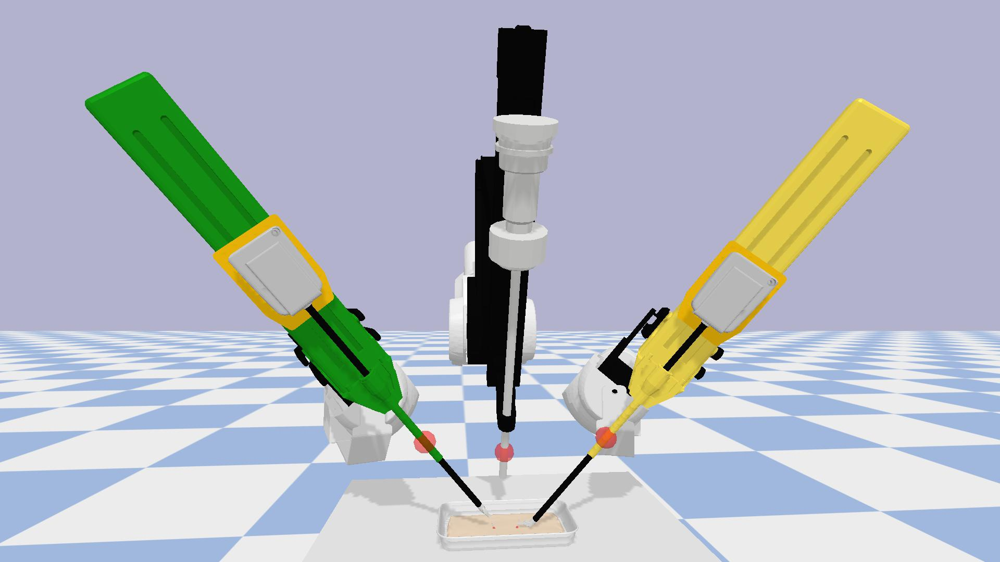

## dVRK Robots

This folder contains the implementation of dVRK robots (PSM & RCM) with PyBullet, which follows the files in [dVRK ROS](https://github.com/jhu-dvrk/dvrk-ros/tree/master/dvrk_python).

   

Now, we are using the PyBullet built-in functions to compute the forward and inverse kinematics of the robots.
The computed results are in the world frame by default.
We need to do some transformation between the world and RCM space.
Optionally, we can use the [Peter Corke robotics toolbox](https://github.com/petercorke/robotics-toolbox-python).